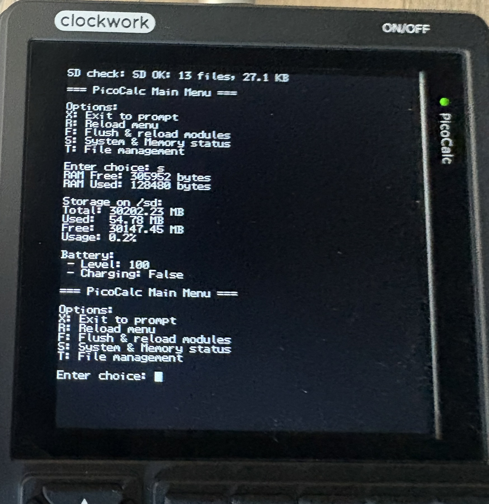
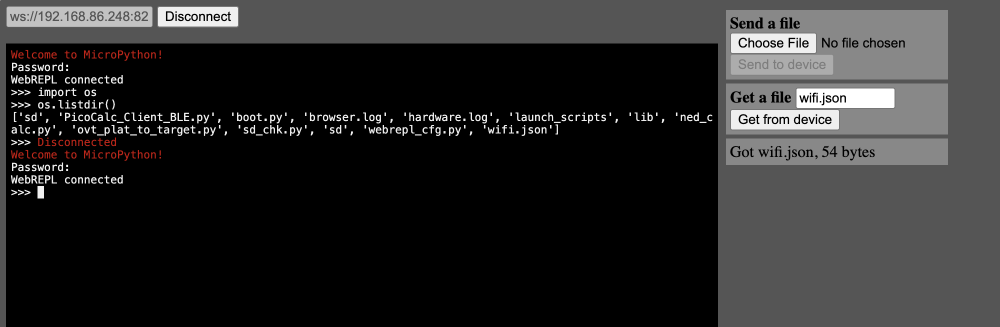

#  PicoCalc Micropython Setup

I am finding embedded development to be an infuriating experience.  Thanks to the community for making this barely understandable for my primitive brain.

You'll notice a lot of geospatial and math stuff being added.  I use a TI Nspire graphing calculator to do a lot of Micropython programming.  I'd love to transition to this.

## Features

* Libraries I've Added from MicroPython Package Manager
    * `logging`
    * `os.path`
* Libraries I include via build scripts
    * `ulab`
* Libraries I've Modified:
    * `picocalc` : Minor updates to `zenodante`'s API.
        * Fixed bugs in a bunch of utilities.
    * `pye` : Updated from [git@github.com:robert-hh/Micropython-Editor.git](git@github.com:robert-hh/Micropython-Editor.git)
* Libraries I'm Writing
    * `turtle.py`   : My start of a turtle API for PicoCalc.
* Tests:
    * `picotests/drawing.py`  : Sample of `turtle` drawing calls.
    * `picotests/hardware.py` : Sample of calling PicoCalc hardware.
        * Examples:
            * Battery state <span style="color:green">(Requires Keyboard Driver Update)</span>
            * Screen backlight
            * Keyboard backlight
* Tools:
    * `keytest.py` :  Script for logging keyboard inputs


## References:

Thank you to everyone who has been adding MicroPython code for PicoCalc.

* [zenodante/PicoCalc-micropython-driver](https://github.com/zenodante/PicoCalc-micropython-driver/tree/main)
* [LofiFren/PicoCalc](https://github.com/LofiFren/PicoCalc/tree/main)

## Quickstart


### Step 1:  Copy RP2+W (2350 + Wifi) image to device
1. Image is located in `./images/firmware.rp2350.wifi.uf2`

2. **Copy Base Image to Hardware:**
    * Hold down reset button on the RP hardware.
    * Insert USB-Micro cable connect to your computer.
    * Release button on the RP hardware
    * Your device should have a filesystem mount for the Pico hardware.
    * Drag **ONLY** the pico firmware UF2 file to this device.
    * The device will unmount itself, likely generating an annoying error.
    * Remove the USB cable.

### Step 2: Copy Support Scripts <u>prior</u> to booting device

* Reconnect the USB-micro cable to the 2350 hardare
* Restart the Thonny instance
* Setup Thonny
* Copy the following files.
    * `./boot.py`
    * `./lib/`

### Step 3: Launch PicoCalc

* Remove the USB-micro cable
* Press Power button

### Step 4:  Launch Status Menu
This menu is the first thing presented to the user upon boot.

* The launcher in zenodante's repo has been updated to print system status with the `s` key.
* Exit with `x`

<center>
 
</center>


## Step 5: Setup WiFi and Web-REPL

```python
import picocalc.wifi as wifi
wifi.init().scan()

#  Find your wifi in the printout
wifi.init().connect( ssid_str, password_str )
import webrepl_setup
```
**Note:** your password and ssid should be saved to disk.

Now, to setup the Web-REPL, do the following:
```python
picocalc.wifi.webrepl()
```

Now, you can connect to the PicoCalc's terminal without having to use a USB cable.
<center>
 
</center>

---

## Building the Micropython Image

See [this README](./docs/setup.md) for building and configuration of the MicroPython image.

---

## Libraries

### `turtle.py`

This wraps the `picocalc` API and other tools to create a mildly functional version of turtle.


---

## Tools

### `browser.py`
TODO

### `keytest.py`

This is a simple script to log the values of keys pressed.  This can be clutch when you are writing an app and you want to know what a particular key is.  This will print values to the terminal until you press Escape. The escape value will be printed, and the application will exit.

```python
import keytest as kt
kt.run()
```

In this example, I disabled the `p` character so it would register as unknown.  See how unknown characters get returned.  This is not in CM.

<center>
 
</center>

<span style="color:red"><b><u>TODO:</u></b></span> Use the turtle display API to allow taking screenshots.

# Tasks / Todo

* [ ] - Add Wifi status to launch script.
* [ ] - Update launch script to test/verify/fix bugs in other features.


# Developer Notes

* I'd love to know how to ditch Thonny.  I'm not very efficient with it, and I find it irritating.  Thonny has 2 huge perks I cannot find elsewhere:
    * It has a very robust version of Micropython's PIP API.  You can install dependencies from `micropython-lib` very easily.
        * I anticipation of this, I've tried to put dependencies into this repo directly, so I can own things inside `./lib` and people won't need to use Thonny to sync.  That said, this is up to you.
    * It tends to work 100% of the time when I do the following:
        - Turn off PicoCalc hardware
        - Kill Thonny session
        - Plug in USB-Micro cable into PicoCalc
        - Open Thonny
            - By default, my session opens to inside the "repo" folder where I transfer everything.
        - It auto-connects and finds the PicoCalc's RP 2350 drivers
            - **Note:** The PicoCalc **must** be turned off, thus the LED on the front panel of the PicoCalc is not lit.
        - You right-click on the `./lib` folder, selecting **Focus-Into**.  This sets the device's **cwd/internal** folder inside `./lib`.
        - Select files you want to sync (first time users select everything), then **right-click**, then


