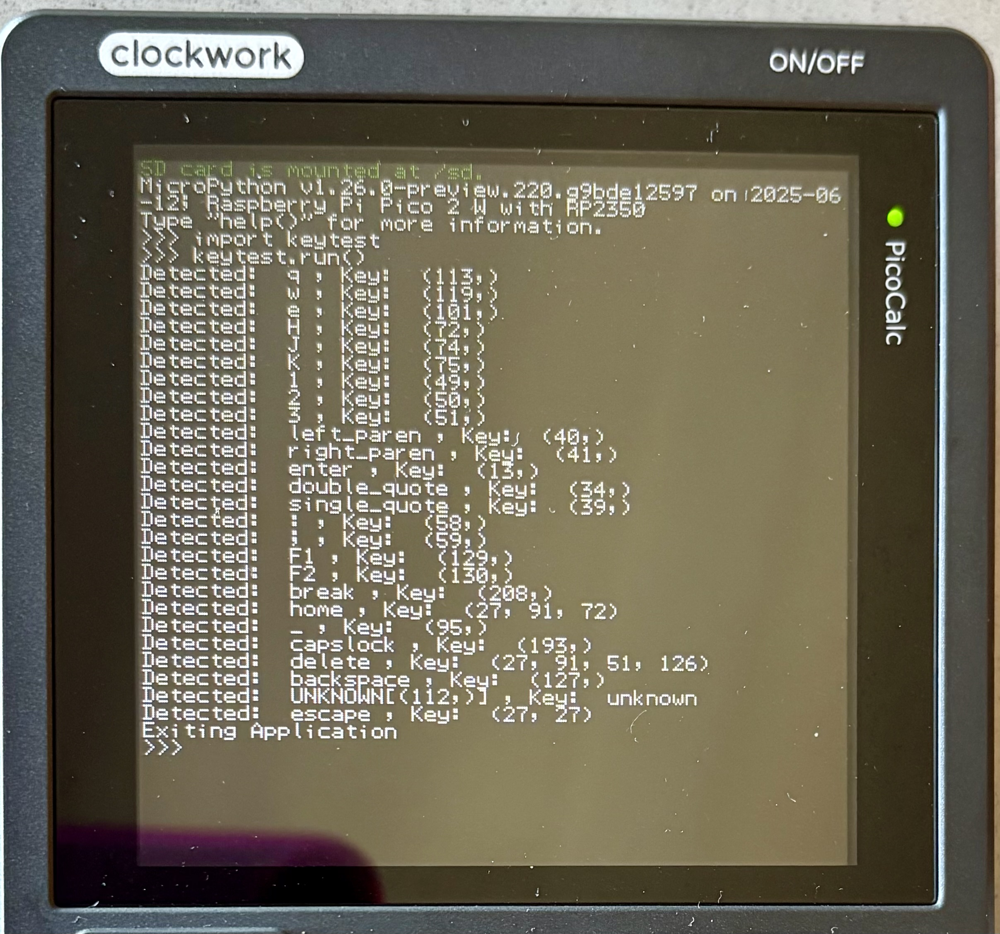
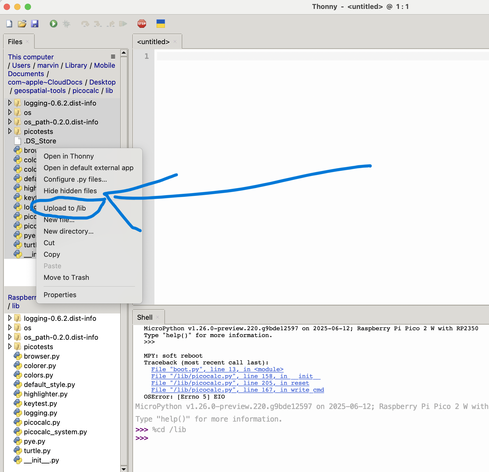

#  PicoCalc Micropython Setup

I am finding embedded development to be an infuriating experience.  Thanks to the community for making this barely understandable for my primitive brain.

## Features

* Libraries:
    * `picocalc` : Minor updates to `zenodante`'s API.
    * `turtle.py`   : My start of a turtle API for PicoCalc.
* Tests:
    * `picotests/drawing.py`  : Sample of `turtle` drawing calls.
    * `picotests/hardware.py` : Sample of calling PicoCalc hardware.
        * Examples:
            * Battery state <span style="color:red">(not working yet)</span>
            * Screen backlight
            * Keyboard backlight
* Tools:
    * `keytest.py` :  Script for logging keyboard inputs


## References:

* [zenodante/PicoCalc-micropython-driver](https://github.com/zenodante/PicoCalc-micropython-driver/tree/main)

## Quickstart

### Step 1:  Copy RP2+W (2350 + Wifi) image to device
* Per Experience, Not Documentation!
* **Copy Base Image to Hardware:**
    * Hold down reset button on the RP hardware.
    * Insert USB-Micro cable connect to your computer.
    * Release button on the RP hardware
    * Your device should have a filesystem mount for the Pico hardware.
    * Drag **ONLY** the pico firmware UF2 file to this device.
    * The device will unmount itself, likely generating an annoying error. 
* **Copy Support Scripts <u>prior</u> to booting device**
    * Disconnect and reconnect the USB-micro cable to the 2350 hardare
    * Restart the Thonny instance
    * Setup Thonny
        * Navigate to the `./lib` folder on the RP 2350 hardware
    * <span style="color:red">See Developer docs for help unti lI have mental bandwidth to correct these notes</span>
    


## Pre-Setup Notes:

* I chose to not use `zenodante`'s approach to compile the core APIs as frozen files.  This makes it impossible to edit them from my laptop after you setup the PicoCalc.
    * For newbies like me, `frozen` files are Python sources you `compile` into bytecode.  This makes them exist in the filesystem, but not using the built-in filesystem.  Aka:  Consider it a *magical* filesystem.

* I instead only keep the `boot.py` and `main.py` from the filesystem variant. Everything else goes into this `./lib` folder.

* I have copies of the files, latest as of 6/13/2025, in my repo.  I modified them a bit, as a few minor parts if his APIs are non-functional. 

* <span style="color:red"><b><u>TODO: Submit PR to zenodante's repo with relvent changes!</u></b></span>


## Setup Pico

<span style="color:red"><b><u>TODO: Make these dependencies submodules</u></b></span>

I duplicated the effort by doing the following steps:

### 1. Create a folder to hold the workspace

```bash
mkdir workspace
pushd workspace
```

**Note:** The final structure will look like this:

```bash
tree -L 1 ./workspace
./workspace
├── eigenmath_micropython
├── micropython
└── PicoCalc-micropython-driver
```

### 2. Clone `PicoCalc-micropython-driver` repo into workspace folder. 

```bash
git clone git@github.com:zenodante/PicoCalc-micropython-driver.git
pushd PicoCalc-micropython-driver
git remote update --init --recursive
popd
```

### 3. Clone Micropython repo into workspace folder

```bash
git clone git@github.com:micropython/micropython.git
pushd micropython
git remote update --init --recursive
popd
```

### 4. Clone Eigenmath Repo into workspace folder

```bash
git clone git@github.com:zenodante/eigenmath_micropython.git
pushd eigenmath_micropython
git remote update --init --recursive
popd
```

### 5. Setup Micropython build

<span style="color:red"><b><u>TODO: Cleanup Script!</u></b></span>
```bash
pushd micropython/ports/rp2
mkdir build
pushd build

# Where you cloned this repo, where this README lives
cp <repo-path>/scripts/build-micropython.sh .
./build-micropython

# Go back to workspace folder
popd
popd

```

### 6. Connect Pico 2W to Thonny

### 7. Create /lib folder

On the terminal, run the following shell command on the repl:

```python
import os
os.makedirs('/lib')
```

### 8. Copy Project files

**Note:** I have the Micropython `logging` and `os-path` sources already added to this folder.   You can skip this if you want ot use Micropython's PIP API in Thonny instead.

**Process:** Copy `./lib` to `/lib` on the Pico.

---

## Libraries

### `turtle.py`

This wraps the `picocalc` API and other tools to create a mildly functional version of turtle. 


---

## Tools

### `browser.py`

### `keytest.py`

This is a simple script to log the values of keys pressed.  This can be clutch when you are writing an app and you want to know what a particular key is.  This will print values to the terminal until you press Escape. The escape value will be printed, and the application will exit.

```python
import keytest as kt
kt.run()
```

In this example, I disabled the `p` character so it would register as unknown.  See how unknown characters get returned.  This is not in CM.

<center>
 
</center>

<span style="color:red"><b><u>TODO:</u></b></span> Use the turtle display API to allow taking screenshots.

# Developer Notes

* I'd love to know how to ditch Thonny.  I'm not very efficient with it, and I find it irritating.  Thonny has 2 huge perks I cannot find elsewhere:
    * It has a very robust version of Micropython's PIP API.  You can install dependencies from `micropython-lib` very easily. 
        * I anticipation of this, I've tried to put dependencies into this repo directly, so I can own things inside `./lib` and people won't need to use Thonny to sync.  That said, this is up to you.
    * It tends to work 100% of the time when I do the following:
        - Turn off PicoCalc hardware
        - Kill Thonny session
        - Plug in USB-Micro cable into PicoCalc
        - Open Thonny
            - By default, my session opens to inside the "repo" folder where I transfer everything.
        - It auto-connects and finds the PicoCalc's RP 2350 drivers 
            - **Note:** The PicoCalc **must** be turned off, thus the LED on the front panel of the PicoCalc is not lit.
        - You right-click on the `./lib` folder, selecting **Focus-Into**.  This sets the device's **cwd/internal** folder inside `./lib`.
        - Select files you want to sync (first time users select everything), then **right-click**, then 


